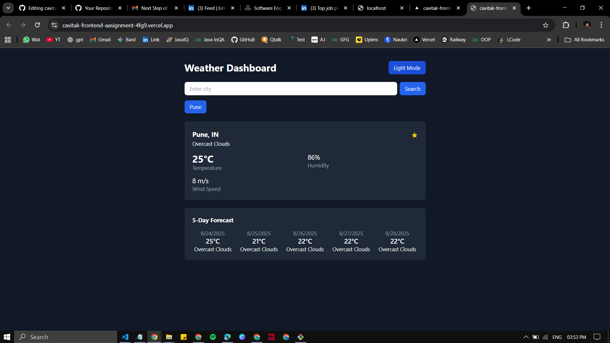
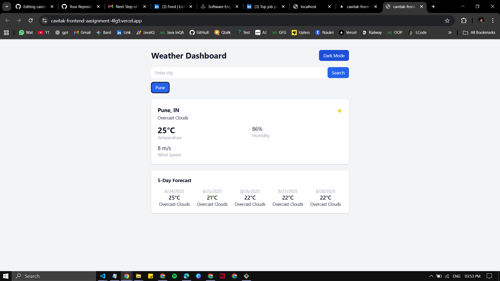

# Weather Dashboard

I built a simple weather dashboard using **HTML, CSS, and JavaScript**, and to make things easier and more modern I used **Next.js** and **Tailwind CSS**.  
The app lets you search for any city and see the current weather details along with a 5-day forecast.  
 


## Features
- Search weather by city name  
- Display temperature, humidity, wind speed, and condition  
- 5-day forecast with daily summary  
- Save favorite cities (stored in local storage)  
- Dark/Light mode toggle with preference persistence  
- Loading and error handling  
- Responsive design

## Live Demo
[View Project on Vercel](https://cavitak-frontend-aasignment-4fg9.vercel.app/)


## Tech Stack
- Next.js (React framework)  
- Tailwind CSS for styling  
- OpenWeatherMap API for weather data


## Screenshots

### Dark Mode


### Light Mode



## Getting Started

### Prerequisites
- OpenWeatherMap API key (free at [https://openweathermap.org/](https://openweathermap.org/))  


## Folder Structure

```
.
├── components/        # Reusable UI components
├── pages/             # Next.js pages
├── styles/            # Global styles (Tailwind CSS)
└── README.md
```


## Notes

* This project requires a valid OpenWeatherMap API key.
* Tested on both desktop and mobile for responsiveness.
* I made this project with **HTML, CSS, and JavaScript**, but I used **Next.js** and **Tailwind CSS** to organize and manage everything in a modern way. In the end,, it still runs on plain HTML, CSS, and JavaScript these tools just make the development process smoother and more efficient.  

